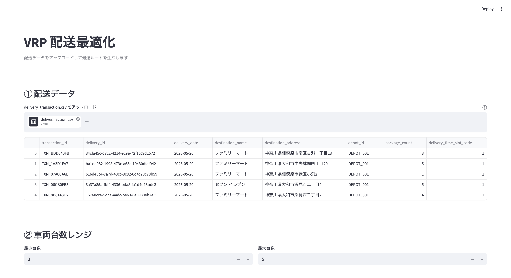
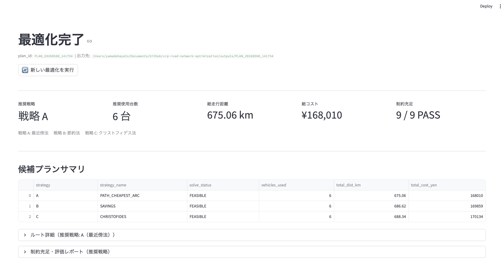
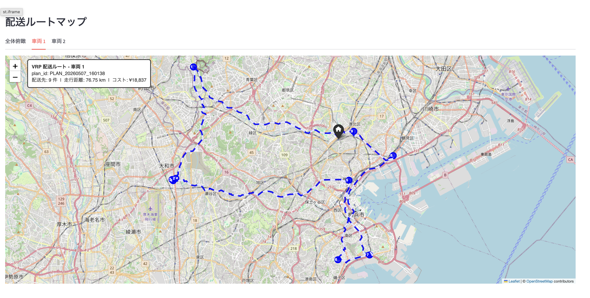

# VRP Road Network Optimization

配送ルート最適化において直線距離や概算値を使うと、実際の道路と乖離したルート案になり、使用台数・総走行距離にもとづくコスト精算の精度が下がります。またツールがなければルート組みは担当者の経験に頼るしかなく、再現性のない属人化した計画になりがちです。

本プロジェクトは OpenStreetMap の実道路ネットワークを用い、一方通行・時間帯制約・積載制約を踏まえた実道路距離で VRP を解くことで、使用台数とコストを最小化した再現可能なルート案を提示します。

## 目的

全配送先への配送することを満たしつつ、使用台数と走行コストの最小化を目的としています。OpenStretMapの道路ネットワークを用い、道路情報や配送における制約などを踏まえた経路から最適な配送組を行います。

- **コスト最小化** — `使用台数 × 固定費 + 総走行距離 × 距離単価` を数理最適化で解く
- **実道路ベースの距離・時間** — 道路情報を反映した距離と静的推定所要時間を使用
- **再現性** — 台数・ルート順・区間距離などの制約チェック結果を出力することで、担当者が変更しても同一条件で計画を再現・検証できる

## 課題

本プロジェクトは、`使用台数 × 固定費 + 総走行距離 × 距離単価` を実道路距離で最小化し、制約を満たす使用台数とコスト参考値を算出することで、これら3つの課題に対して計算根拠のある判断材料を提供します。

**使用台数の根拠不足** — 使用台数を経験則で決めているケースが多く、当日の荷物量や配送における制約を踏まえた適切な台数算出ができていません。台数が過剰になると固定費が増加し、コストの上振れが起きやすい構造になっています。

**コスト根拠の不在** — 使用台数が慣習で半固定化されており、ルート選択もドライバーの経験と勘に依存しているため、本来より低コスト・最適なルートが見落とされている可能性があります。計画の妥当性を数字で示す手段がなく、感覚値にとどまりがちです。

**決定の属人化** — 配送組みがベテラン担当者の経験に依存しているため、担当者が変わると計画品質が変わります。必要台数を事前に算出できれば、ドライバーの早期手配や外部委託の判断もしやすくなります。担当者の経験に頼らない計画立案の仕組み作りが求められています。

## スコープ

* **対象エリア** — 神奈川県
* **配送形態** — 単一デポ、デポ出発・デポ帰着
* **配送体制** — ドライバー数 = 使用台数（1人1台）
* **需要量単位** — 荷物個数
* **使用台数** — 当日の稼働台数をUIで指定（デポマスタの登録値が初期値・上限）。ソルバーが指定台数以下でコスト最小の台数を自動決定する
* **車両モデル** — 全車両同一モデル。積載上限はdepot_masterに登録したcapacity_per_vehicleを全車両に共通適用
* **勤務時間** — depot_masterに登録した就業時間内にデポへ帰着
* **時間帯区分** — 午前 / 午後 / 時間指定なし の3区分
* **時間計算** — 静的推定時間を使用。動的交通情報（渋滞等）は対象外（商用地図APIを使用しない方針）
* **主目的関数** — `総コスト = 使用台数 × 固定費 + 総走行距離 × 距離単価`
* **出力** — 最近傍法・節約法・クリストフィデス法の3戦略による候補プランを提示。最終的な選択はユーザーが行う
* **例外時** — 住所不備・ジオコーディング失敗・ネットワーク割当失敗がある場合は失敗地点を除いた暫定結果を返す

## 特徴

直線距離や概算距離ではなく、OSM の実道路ネットワークを前提にした配送計画システムです。

* **実道路ベースの距離・時間** — OSM の有向グラフで一方通行を反映した実道路距離を使用。時間計算は静的推定時間を採用（商用地図 API は不使用）。県単位のネットワークを初回のみ取得・キャッシュし、以降の実行では外部アクセスなしで処理できる。
* **3 戦略による候補プラン比較** — 最近傍法・節約法・クリストフィデス法の 3 戦略で同時に解を探索し、コスト・台数・ルート構造の異なる候補プランを 1 回の実行で比較できる。最適解を一意に提示するのではなく、最終的な選択はユーザーが行う設計。
* **再現性・属人化の排除** — 同一の入力データと設定であれば同一の候補プランが得られる。使用台数・ルート順・区間距離・到着推定時刻・コスト内訳がすべて出力されるため、担当者が変わっても計画の根拠を引き継げる。
* **制約チェック結果の出力** — 積載・時間帯・勤務時間帰着など 9 項目の制約を PASS / FAIL 形式で記録。どの条件を満たしているかを定量的に確認できる。
* **スナップ品質の 3 段階評価** — 配送先住所を OSM ノードにスナップした際の距離を `ok（〜100 m）/ caution（〜200 m）/ warning（200 m 超）` の 3 段階で記録し、精度の低い地点を早期に検出できる。
* GoogleMapsとの距離検証 ー OSMnxで算出した距離をGoogleMapsの実測値と比較し、推定精度の乖離を定量的に確認できる検証フローの整備をしている。

## スクリーンショット

### 入力画面（初期状態）


### 入力画面（データ入力後）



### 最適化結果



### 配送ルートマップ



## 技術スタック・選定理由

| カテゴリ         | 採用技術                 | 選定理由                                                                                  |
| ---------------- | ------------------------ | ----------------------------------------------------------------------------------------- |
| 道路ネットワーク | OSMnx                    | OSM から有向グラフを直接取得・保存でき、再現性が高い                                      |
| 最短経路         | NetworkX（Dijkstra）     | OSMnx と統合されており、実道路距離を正確に算出できる                                      |
| VRP ソルバー     | OR-Tools Routing Library | VRP 専用 API により変数爆発を回避。大規模問題（100 件以上）でも実用的な時間で解が得られる |
| 地図可視化       | Folium + AntPath         | Python から HTML マップを生成でき、道路沿いルートと進行方向を表現できる                   |
| バックエンド     | FastAPI                  | 長時間ジョブを別プロセスで実行し、フロントエンドからポーリングできる非同期構成を実現      |
| フロントエンド   | Streamlit                | バックエンドと同一言語で統一でき、技術スタックの分散を避けることが可能                    |
| ジオコーディング | 国土地理院（GSI）API     | 無償・API キー不要。都道府県フィルタと粒度チェックで誤ジオコーディングを自動除外          |

### ソルバー選定の詳細

OR-Tools には Routing Library（ヒューリスティック探索）と CP-SAT（制約プログラミング）の 2 つがあります。初期検証（19 配送先）では CP-SAT が 2.25 秒で OPTIMAL を達成しましたが、100 配送先・12 台への拡張時にタイムアウトが発生しました。

CP-SAT は VRP を汎用制約プログラミングで定式化するため、車両台数 k・地点数 n に対して O(k × n²) のバイナリ変数を生成します。100 配送先・k=12 では約 12 万変数となり、制限時間内に実行可能解すら見つかりませんでした。

Routing Library は VRP 専用に設計されており変数爆発が起きないため、現行の本番構成として採用しています。

|                      | Routing Library（現行）    | CP-SAT（初期検証）     |
| -------------------- | -------------------------- | ---------------------- |
| 解法                 | ヒューリスティック         | 完全探索（分枝限定法） |
| 最適性保証           | なし                       | OPTIMAL で保証あり     |
| 変数数               | 内部処理（変数爆発なし）   | O(k × n²)            |
| 大規模（100 件以上） | 実用的な時間で解が得られる | タイムアウト           |

## 動かし方

### 前提

- Python 3.11 以上
- 本リポジトリをクローンして仮想環境を構築済みであること

```bash
git clone https://github.com/19HY21/vrp-road-network-optimization.git
cd vrp-road-network-optimization
python -m venv venv
source venv/bin/activate
pip install -e .
```

### 道路ネットワークの取得（初回のみ）

GraphML ファイルはサイズが大きいためリポジトリに含まれていません。初回起動前に以下のコマンドで取得してください。Overpass API へのアクセスが発生するため、完了まで数分かかります。

```bash
python -m vrp_optimization.network.graph
```

取得完了後は `data/processed/osm_network/kanagawa_drive_latest.graphml` が生成されます。以降の実行ではキャッシュが再利用されます。

#### 対象エリアを変更する場合

神奈川県以外を対象にする場合は以下の3箇所を変更してください。

| ファイル                                                                                | 変数            | デフォルト値                      | 変更例                         |
| --------------------------------------------------------------------------------------- | --------------- | --------------------------------- | ------------------------------ |
| [src/vrp_optimization/network/graph.py](src/vrp_optimization/network/graph.py#L35)         | `PLACE`       | `"Kanagawa, Japan"`             | `"Tokyo, Japan"`             |
| [src/vrp_optimization/network/graph.py](src/vrp_optimization/network/graph.py#L33)         | `LATEST_PATH` | `kanagawa_drive_latest.graphml` | `tokyo_drive_latest.graphml` |
| [src/vrp_optimization/visualization/map.py](src/vrp_optimization/visualization/map.py#L27) | `GRAPH_PATH`  | `kanagawa_drive_latest.graphml` | `tokyo_drive_latest.graphml` |

変更後、再度 `python -m vrp_optimization.network.graph` を実行すると新しいエリアのネットワークが取得されます。

### 入力 CSV フォーマット

| 物理名                      | 論理名                 | 説明                                                                                                      |
| --------------------------- | ---------------------- | --------------------------------------------------------------------------------------------------------- |
| `transaction_id`          | トランザクション識別ID | 各行を一意に識別するID。データの追跡・ポータビリティのために使用                                          |
| `delivery_date`           | 配送日                 | 配送を実施する日付（例: 2026-05-25）                                                                      |
| `destination_name`        | 配送先名称             | 配送先の名称。サンプルデータではPOI名称を住所取得のラベルとして使用                                       |
| `destination_address`     | 配送先住所             | ジオコーディングで座標に変換される住所。丁目・番地まで含めることを推奨                                    |
| `package_count`           | 荷物個数               | その配送先に届けなければならない荷物の数。積載制約の計算に使用                                            |
| `delivery_time_slot_code` | 配送時間帯コード       | `data/raw/time_slot_master.csv` を参照（1: 午前 09:00〜13:00 / 2: 午後 13:00〜18:00 / 3: 時間指定なし） |

> **Note**: `delivery_id` は入力 CSV に含まれていない場合、ジオコーディング時にシステムが自動付与します。

### 起動

```bash
bash start.sh
```

ブラウザで `http://localhost:8501` が自動的に開きます。

### 操作手順

1. **① 配送データ** — 配送データ CSV をアップロード（先頭 5 件のプレビューが自動表示される）サンプルデータが必要な場合は以下のコマンドで生成できます。

   ```bash
   python src/vrp_optimization/data_generation/delivery_transaction/fetch_kanagawa_poi.py
   ```

   → `data/raw/delivery_transaction_1000.csv` が生成されます
2. **② デポ選択** — `data/raw/depot_master.csv` に登録されているデポから選択（積載上限・最大稼働台数・勤務時間が自動表示。積載制約からの最低必要台数の目安も表示される）
3. **③ 車両台数** — 当日の稼働台数を入力（デポマスタ登録値が初期値。登録値を超えると警告が表示され、実行時にエラーとなる）
4. **④ ソルバー設定** — 1 戦略あたりの探索時間を UI で設定（デフォルト 120 秒 × 3 戦略。目安: 〜20 件 30 秒 / 〜50 件 60 秒 / 〜100 件 120 秒以上）
5. **⑤ 出力先フォルダ** — 結果を保存するフォルダを選択
6. **「最適化を実行」** — ボタンをクリック
7. 完了後、画面上に推奨戦略の詳細と配送ルートマップを表示。出力先フォルダには以下が保存される

   | ファイル                                    | 内容                                   |
   | ------------------------------------------- | -------------------------------------- |
   | `route_summary.csv`                       | 戦略別コスト・使用台数サマリ           |
   | `route_detail.csv`                        | 車両別ルート順・区間距離・到着推定時刻 |
   | `evaluation_report.csv`                   | 制約チェック 9 項目（PASS / FAIL）     |
   | `route_map_strategy_{A/B/C}.html`         | 戦略別全体俯瞰マップ                   |
   | `route_map_vehicle_{n}_strategy_{s}.html` | 車両別詳細マップ（道路沿い）           |

## パイプライン

### 処理フロー概要

```
【入力】
配送データ CSV（UI アップロード または サンプルデータ生成）
    ↓
① 住所正規化 / ジオコーディング
   $ python -m vrp_optimization.preprocessing.geocode {input_stem}
    ↓
② OSM 最近傍ノードへのスナップ処理
   $ python -m vrp_optimization.network.snap {input_stem}
    ↓
③ OD 行列計算（Dijkstra 最短経路）
   $ python -m vrp_optimization.distance_matrix.compute {depot_id} {input_stem}
    ↓
④ VRP 最適化（OR-Tools / 3 戦略）
   $ python -m vrp_optimization.solver.vrp_routing {plan_id} {depot_id}
    ↓
⑤ 制約充足チェック・推奨戦略の決定
   $ python -m vrp_optimization.evaluation.evaluate {plan_id} {depot_id} {input_stem}
    ↓
⑥ ルートマップ生成
   $ python -m vrp_optimization.visualization.map {plan_id} {depot_id} {input_stem}
    ↓
⑦ 出力先フォルダへ保存（UI 経由、または api/pipeline.py）
```

### 詳細

```
【入力】
data/raw/delivery_transaction_{filename}.csv （UI アップロード）
または
data/raw/delivery_transaction_1000.csv       （fetch_kanagawa_poi.py で生成）

    ↓

① 住所正規化 / ジオコーディング
   スクリプト: src/vrp_optimization/preprocessing/geocode.py
   ・国土地理院 API で住所を緯度経度に変換
   ・都道府県フィルタ・粒度チェックで不正住所を除外
   ・100 件ごとにチェックポイント保存（障害時リカバリ対応）
   出力: data/processed/geocode/{input_stem}/delivery_destination_master.json

    ↓

② OSM 最近傍ノードへのスナップ処理
   スクリプト: src/vrp_optimization/network/snap.py
   ・ジオコーディング済み座標を OSM 道路ネットワーク上の最近傍ノードに割り当て
   ・スナップ距離を ok / caution / warning の 3 段階で品質評価
   入力: data/processed/geocode/{input_stem}/delivery_destination_master.json
   出力: data/processed/snap/{input_stem}/snap_destination_master.json

    ↓

③ OD 行列計算（Dijkstra 最短経路）
   スクリプト: src/vrp_optimization/distance_matrix/compute.py
   ・デポ〜全配送先間の実道路距離と静的推定所要時間を算出
   入力: data/processed/snap/{input_stem}/snap_destination_master.json
   出力: data/processed/compute/{input_stem}/{depot_id}/od_matrix.csv

    ↓

④ VRP 最適化（OR-Tools Routing Library）
   スクリプト: src/vrp_optimization/solver/vrp_routing.py
   ・最近傍法 / 節約法 / クリストフィデス法の 3 戦略で同時探索
   ・制約時間内にコスト最小の使用台数をソルバーが自動決定
   入力: data/processed/compute/{input_stem}/{depot_id}/od_matrix.csv
   出力: outputs/{plan_id}/output/table/route_summary.csv
         outputs/{plan_id}/output/table/route_detail.csv

    ↓

⑤ 制約充足チェック・推奨戦略の決定（9 項目）
   スクリプト: src/vrp_optimization/evaluation/evaluate.py
   ・積載 / 時間帯 / 勤務時間帰着などの制約を PASS / FAIL で評価
   ・3 戦略のうちコスト最小かつ制約を満たす戦略を推奨戦略として決定
   出力: outputs/{plan_id}/output/table/evaluation_report.csv

    ↓

⑥ ルートマップ生成（Folium + AntPath）
   スクリプト: src/vrp_optimization/visualization/map.py
   ・戦略別全体俯瞰マップ（直線）
   ・戦略別車両別詳細マップ（実道路沿い + AntPath 進行方向矢印）
   出力: outputs/{plan_id}/output/image/route_map_strategy_{A/B/C}.html
         outputs/{plan_id}/output/image/route_map_vehicle_{n}_strategy_{s}.html

    ↓

⑦ 出力先フォルダへ保存
   スクリプト: api/pipeline.py
   ・UI で指定したフォルダに {plan_id}/ ごとコピー
   出力: {指定フォルダ}/{plan_id}/

    ↓

【オプション：Google Maps との距離検証】

   OSMnx で算出した距離と Google Maps の実測距離を比較することで、
   推定精度の乖離を定量的に確認できます。

   Step 1. 検証用 OD ペア CSV を生成
      スクリプト: scripts/generate_gas_input.py
      実行: python scripts/generate_gas_input.py {input_stem} {depot_id}
      入力: data/processed/snap/{input_stem}/snap_destination_master.json
      出力: outputs/PLAN_{input_stem}_{depot_id}/validation/gas_input.csv

   Step 2. gas_input.csv を Google スプレッドシートに取り込み、
      GAS スクリプト（scripts/google_maps/calc_google_maps_from_lat_lon.gs）
      を実行して Google Maps の距離・所要時間を取得

   Step 3. スプレッドシートを CSV としてエクスポートし、
      OSMnx 距離との差分を比較
```

## 検証結果・知見

### PoC 実行例（配送先 96 件）

| 項目               | 値                                 |
| ------------------ | ---------------------------------- |
| 推奨戦略           | C（クリストフィデス法）            |
| 推奨使用台数       | 6 台（上限 12 台に対し数理的最小） |
| 総走行距離         | 688.34 km                          |
| 総コスト           | ¥170,134                          |
| ソルバーステータス | FEASIBLE（3 戦略すべて）           |
| 制約充足           | 9 項目 PASS / 0 FAIL               |

100 件の入力データのうち住所粒度不足・都道府県外ジオコーディングにより 4 件が除外され、96 件を対象に最適化を実施。上限 12 台の指定に対してソルバーが 6 台で全配送可能と判断し、コスト最小の使用台数を自動決定しました。制約充足 9 項目 PASS は、時間帯・積載・勤務時間のすべての条件を満たすことを示しています。

### 3 戦略の比較結果（96 件）

| 戦略        | 手法                                         | 使用台数       | 総距離              | 総コスト            |
| ----------- | -------------------------------------------- | -------------- | ------------------- | ------------------- |
| A           | 最近傍法（PATH_CHEAPEST_ARC）                | 6 台           | 692.59 km           | ¥170,814           |
| B           | 節約法（SAVINGS）                            | 6 台           | 697.04 km           | ¥171,526           |
| **C** | **クリストフィデス法（CHRISTOFIDES）** | **6 台** | **688.34 km** | **¥170,134** |

### PoC 実行例（配送先 853 件 / 1000 件入力）

| 項目               | 値                                   |
| ------------------ | ------------------------------------ |
| 推奨戦略           | B（節約法）                          |
| 推奨使用台数       | 56 台（上限 60 台）                  |
| 総走行距離         | 3,627.03 km                          |
| 総コスト           | ¥1,140,325                          |
| ソルバーステータス | FEASIBLE（3 戦略すべて）             |
| 制約充足           | 27 項目 PASS / 0 FAIL（9 項目 × 3 戦略） |

1000 件の入力データのうち住所粒度不足・ジオコーディング失敗等により 147 件が除外され、853 件を対象に最適化を実施。上限 60 台の指定に対してソルバーが 56 台で全配送可能と判断。午前指定 281 件・午後指定 271 件を含む時間帯制約がすべて充足され、9 項目の制約チェックが 3 戦略すべてで PASS。

### 3 戦略の比較結果（1000 件 / DEPOT_002）

| 戦略        | 手法                                         | 使用台数        | 総距離                | 総コスト               |
| ----------- | -------------------------------------------- | --------------- | --------------------- | ---------------------- |
| A           | 最近傍法（PATH_CHEAPEST_ARC）                | 56 台           | 3,762.73 km           | ¥1,162,037            |
| **B** | **節約法（SAVINGS）**                  | **56 台** | **3,627.03 km** | **¥1,140,325** |
| C           | クリストフィデス法（CHRISTOFIDES）           | 56 台           | 3,847.30 km           | ¥1,175,568            |

### OSMnx vs Google Maps 距離検証

OSMnx で算出した距離と Google Maps の実測距離を全 OD ペアで比較した結果、乖離率の平均は **-16%（OSMnx が短い傾向）** でした。

| 指標                | 値       |
| ------------------- | -------- |
| 比較ペア数          | 380 ペア |
| 許容範囲内（±10%） | 22.9%    |
| 許容範囲外          | 77.1%    |
| 平均乖離率          | -16%     |

> **注記**: GAS（Google Apps Script）経由の Google Maps Distance Matrix API には 1 日あたりの実行クォータ制限があるため、1000 件規模（OD ペア数：数十万規模）での全件検証は実施していません。距離精度の参考値として 96 件 PoC の 380 OD ペアを対象に検証しました。

主な原因は、OSMnx がスナップしたネットワークノードを起点とする一方、Google Maps は実際の建物・入口を起点とする差異と、高速道路の取り扱いの違いです。この乖離により、出力されるコストは実際より低めに見積もられる傾向があります。現時点では概算値として扱い、商用地図データへの切り替えにより精度向上が見込めます。

## 既知の制約・今後の課題

- 対象エリアが神奈川県に限定（道路グラフは事前取得済み）
- 国土地理院 API のレート制限により、住所件数が多い場合はジオコーディングに時間を要する（2 回目以降はキャッシュにより短縮）
- OSMnx 距離と実測距離に約 16% の乖離があり、商用地図データへの切り替えが望ましい
- 動的交通情報（渋滞等）は非対応
- 複数デポ・複数日配送は対象外
- 使用台数の下限強制は未対応（Routing Library の制約による）

## 構成

```text
.
├── api/
│   ├── main.py              # FastAPI サーバー（ジョブ管理）
│   └── pipeline.py          # パイプライン実行オーケストレーター
│
├── app/
│   └── streamlit_app.py     # Streamlit Web アプリ
│
├── data/
│   ├── raw/                 # 入力 CSV（delivery_transaction, depot_master）
│   └── processed/
│       ├── geocode/         # ジオコーディング結果（.gitignore 対象）
│       ├── snap/            # OSM スナップ結果（.gitignore 対象）
│       ├── compute/         # OD 行列（.gitignore 対象）
│       └── osm_network/     # OSM ネットワーク グラフメタデータ
│
├── docs/
│   └── design/              # 設計ドキュメント（00〜08）
│
├── outputs/                 # 最適化結果（.gitignore 対象）
│   └── {plan_id}/
│       └── output/
│           ├── table/       # ルートサマリ・詳細・評価レポート CSV
│           └── image/       # 戦略別ルートマップ HTML
│
├── src/vrp_optimization/
│   ├── data_generation/     # サンプルデータ生成（POI 取得）
│   ├── preprocessing/       # ジオコーディング（国土地理院 API・キャッシュ）
│   ├── network/             # OSMnx グラフ取得・ノードスナップ
│   ├── distance_matrix/     # OD 距離行列計算
│   ├── solver/              # VRP ソルバー（OR-Tools Routing Library）
│   ├── evaluation/          # 制約充足・コスト評価（9 項目）
│   └── visualization/       # Folium ルートマップ生成
│
├── start.sh                 # 起動スクリプト（FastAPI + Streamlit）
└── pyproject.toml
```

## ドキュメント

- 問題定義：[docs/design/00_problem_definition.md](docs/design/00_problem_definition.md)
- 業務要件：[docs/design/01_business_requirements.md](docs/design/01_business_requirements.md)
- データ定義：[docs/design/02_data_definition.md](docs/design/02_data_definition.md)
- 道路ネットワーク設計：[docs/design/03_network_design.md](docs/design/03_network_design.md)
- 数理モデル設計：[docs/design/04_math_model.md](docs/design/04_math_model.md)
- アルゴリズム設計：[docs/design/05_algorithm_design.md](docs/design/05_algorithm_design.md)
- 実験設計：[docs/design/06_experiment_design.md](docs/design/06_experiment_design.md)
- 実装知見と設計修正：[docs/design/07_implementation_findings.md](docs/design/07_implementation_findings.md)
- 需要予測設計：[docs/design/08_demand_forecast_design.md](docs/design/08_demand_forecast_design.md)
