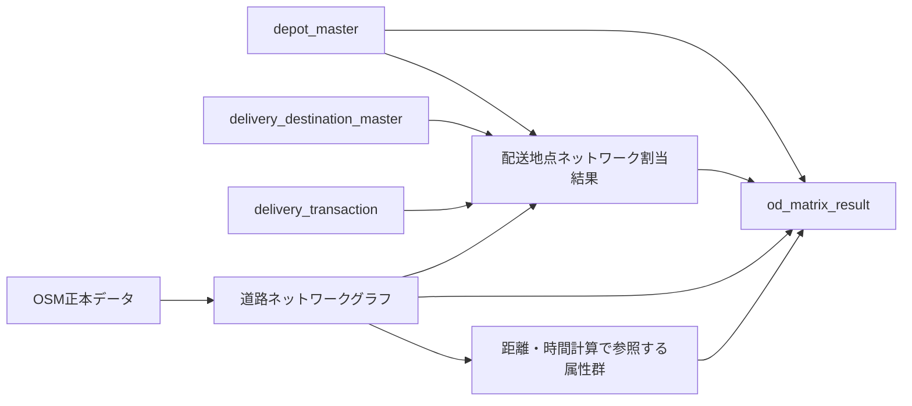

# 道路ネットワーク設計

このドキュメントでは、VRP PoC において利用する実道路ネットワーク基盤の設計方針を整理する。

## 1. ドキュメントの目的

本ドキュメントの目的は、`00_problem_definition.md`、`01_business_requirements.md`、`02_data_definition.md` で整理した問題設定、業務要件、データ定義をもとに、VRP PoC が参照する道路ネットワーク基盤をどのように構築し、どのような単位で保持し、どのように利用するかを明確にすることである。

本 PoC では、直線距離や簡易距離ではなく、OpenStreetMap をもとにした実道路ネットワーク上の道のり距離および静的推定所要時間を利用する。
そのため、本ドキュメントでは、OSM データの取得方針、道路グラフの構成、配送地点のネットワーク割当、距離・時間計算に利用する基盤設計を整理し、後続の数理モデル設計およびアルゴリズム設計へ接続できる状態を目指す。

特に本 PoC では、単に OSM を取得できることではなく、再現可能なネットワーク正本として保存し、同一条件で再実行した場合に同一の道路基盤を参照できることを重視する。そのため、本ドキュメントでは以下を整理対象とする。

- ドキュメントの目的
- 道路ネットワーク設計の方針
- 対象とする道路ネットワーク範囲
- 論理ネットワーク構成
- 道路ネットワーク定義
- ネットワーク利用要件
- 配送地点割当設計
- 距離・時間計算設計
- ネットワーク間の関係
- 更新方針
- 保存方針

これにより、本 PoC における実道路ネットワーク基盤の設計意図と利用範囲を明確にし、後続実装で迷いなく参照できる状態を作る。

## 2. 道路ネットワーク設計の方針

本 PoC では、道路ネットワークの正本として OpenStreetMap を採用する。
理由は、無償または低コストで取得・再利用できること、道路接続、一方通行、道路種別などの実道路に関する属性を保持できること、社内 PoC レベルの検証として十分な再現性と説明可能性を確保できることである。

道路ネットワーク設計の基本方針は以下のとおりとする。

- 道路ネットワークの正本は OSM とする
- 対象範囲は神奈川県全体とする
- 車両配送を前提とするため、`drive` ネットワークを基本とする
- 道路ネットワークは都度取得ではなく、ローカル保存した正本データを再利用する
- 配送地点入力は住所情報とし、住所前処理により緯度経度へ変換する
- 緯度経度は中間表現として扱い、そのまま最適化に利用するのではなく、道路ネットワーク上の参照地点へ割り当てて利用する
- 距離は OSM ネットワーク上の道のり距離を用いる
- 所要時間は OSM 属性に基づく静的推定値とし、必要に応じて補正係数を適用する前提で扱う
- 建物入口や POI を直接利用する方式は、業務誤差緩和の可能性を持つが、現時点では OSM 上の品質ばらつきと照合安定性を踏まえ採用しない
- リアルタイム交通情報を反映した動的時間最適化は対象外とする
- ネットワーク更新時、割当条件変更時、配送対象変更時には必要な範囲で再生成する

これにより、本 PoC では「実道路に即した距離・経路基盤」を、再現性を保ったまま VRP へ供給できる構成を目指す。

## 3. 対象とする道路ネットワーク範囲

本 PoC で対象とする道路ネットワーク範囲は、神奈川県全体とする。
これは、`00_problem_definition.md` および `01_business_requirements.md` で定義した対象範囲に従い、ラストマイル配送を前提とした単一都道府県内配送を扱うためである。

取得対象とするネットワーク種別は `drive` とする。
本 PoC は配送車両によるルート探索を前提としているため、乗用車または配送車両が走行可能な道路を対象とし、歩行者専用ネットワークは対象外とする。

取得方式は、自治体単位での分割取得ではなく、神奈川県全体の一括取得を採用する。
理由は、自治体単位で個別取得した道路ネットワークと、県全体を一括取得した道路ネットワークでは、OSM 側で取得されるデータ構造や接続関係が一致しない場合があるためである。

そのため、自治体単位で取得したネットワークを後から神奈川県全体となるように結合すると、境界部分で道路接続が欠落し、道が途切れる可能性がある。
実際に県全体 routing の検証では、自治体単位取得グラフの再結合方式は不安定であり、県全体で利用する正本ネットワークとしては採用しない判断とする。

本 PoC では、県全体を一括取得した単一の道路ネットワークを正本として扱うことで、配送対象が県内で広く分布していても、単一の整合した道路グラフ上で距離計算およびルート探索を行えるようにする。

また、将来的に県またぎ配送を許容する場合も、対象範囲を一括取得したうえで、必要に応じて利用範囲を切り出す方針とする。
すなわち、最初から細かく分割取得したネットワークを後から結合するのではなく、広域の整合した正本ネットワークを保持し、その一部を利用する方向で拡張する。

## 4. 論理ネットワーク構成

本 PoC では、道路ネットワーク基盤を単一のデータとして扱うのではなく、役割ごとに複数の論理構成要素へ分けて扱う。
ここでいう論理ネットワーク構成とは、どのネットワーク情報を正本として保持し、どの情報を計算基盤として利用し、どの情報を配送地点割当や距離・時間計算へ渡すかを整理したものである。

本 PoC における論理ネットワーク構成は、以下を基本とする。

| 論理構成要素                 | 主な内容                                                   | 主な生成元                                                     | 主な利用処理                 | 更新タイミング               | 役割                                                       | 後続での利用先                   |
| ---------------------------- | ---------------------------------------------------------- | -------------------------------------------------------------- | ---------------------------- | ---------------------------- | ---------------------------------------------------------- | -------------------------------- |
| OSM正本データ                | OSM 由来の元道路データ                                     | OpenStreetMap                                                  | 道路グラフ生成、版管理       | OSM 更新時                   | 道路ネットワークの正本として保持する                       | 道路グラフ生成、版管理           |
| 道路ネットワークグラフ       | ノード、エッジ、接続関係を持つ計算基盤                     | OSM正本データ                                                  | 配送地点割当、距離・時間計算 | 正本更新時または再構築時     | 最短経路計算およびルーティングの基盤を形成する             | 配送地点割当、距離・時間計算     |
| ネットワーク参照属性         | 距離、一方通行、道路種別、速度仮定に利用する属性           | OSM正本データ、道路グラフ                                      | 距離・時間計算、出力生成     | 正本更新時または属性再評価時 | 距離計算、静的所要時間計算、説明可能性の根拠として利用する | 距離・時間計算、評価説明         |
| 配送地点ネットワーク割当結果 | デポおよび配送先を道路ネットワーク上へ割り当てた結果       | 住所前処理結果、道路グラフ                                     | 距離・時間計算、最適化       | 入力変更時または再割当時     | 配送地点をネットワーク上の計算可能地点へ対応づける         | 距離・時間計算、VRP 入力         |
| 距離・時間計算結果           | `plan_id` 単位で生成する OD 間距離および静的推定所要時間 | 配送地点ネットワーク割当結果、道路グラフ、ネットワーク参照属性 | 最適化、出力生成             | 計画実行時または再計算時     | 最適化モデルへ渡す距離・時間入力を提供する                 | `od_matrix_result`、VRP 最適化 |

各構成要素の役割は以下のとおりである。

- OSM正本データ  
  道路ネットワーク基盤の出発点であり、再現性確保のための正本として扱う。PoC では毎回オンライン取得するのではなく、保存済みの正本版を参照する。
- 道路ネットワークグラフ  
  OSM正本データを、ルーティング計算可能なノード・エッジ構造へ変換した計算基盤である。配送地点割当および最短経路計算の土台となる。
- ネットワーク参照属性  
  単なる接続関係だけでなく、距離、一方通行、道路種別、速度仮定など、距離・時間計算やルート説明に必要な道路属性を保持する。
- 配送地点ネットワーク割当結果  
  住所前処理後の緯度経度を中間表現として用い、最終的に道路ネットワーク上の参照地点へ割り当てた結果である。デポおよび配送先を、VRP が扱える地点情報へ変換する役割を持つ。
- 距離・時間計算結果  
  `plan_id` 単位で生成する最終的な距離・時間入力であり、最適化モデルが直接参照する。ここでは、道のり距離と静的推定所要時間を保持する。

本 PoC では、これらの構成要素を明確に分けることで、道路ネットワークの正本管理、計算基盤の構築、配送地点の割当、VRP 入力生成までを一貫した構造で扱えるようにする。

## 5. 道路ネットワーク定義

本章では、本 PoC において利用する道路ネットワークの構成要素を定義する。

### 5.1 OSM正本データ

OSM正本データは、本 PoC における道路ネットワーク基盤の最上位正本である。
対象範囲は神奈川県全体とし、再利用可能なファイル形式で保存する。

OSM正本データは、毎回オンライン取得するのではなく、ローカル保存済みの版を参照する。
これにより、同一条件での再現性を確保するとともに、再実行時の取得コストを抑える。

保持すべき観点は以下とする。

- 対象範囲
- 取得日時
- OSM版識別情報
- 保存ファイルパス

### 5.2 ノード定義

ノードは、道路ネットワークグラフを構成する接続点である。
交差点、道路接続点、曲がり角、経路探索上の分岐点など、道路のつながりが変化する点を表し、エッジと組み合わせてルーティング計算の基盤となる。

OSM 上では `node` は地図上の点として表現されるが、本 PoC ではそのすべてを業務入力地点として使うのではなく、道路グラフ化の過程で経路計算上意味のある接続点として扱う。
そのため、ノードはデポや配送先そのものではなく、後続の配送地点割当処理において参照される道路上の接続基準点として利用する。

ノードで保持を想定する情報は以下とする。

- ノードID
- 緯度経度
- ノード属性

### 5.3 エッジ定義

エッジは、道路ネットワークグラフにおいてノードとノードを接続する道路区間である。
OSM では道路は主に `way` として表現されるが、本 PoC では道路グラフ化の過程で、接続点間の計算可能な道路区間をエッジとして扱う。

エッジには、距離、一方通行、道路種別、速度仮定に利用可能な属性などを保持し、最短距離および静的推定所要時間の計算に利用する。
すなわち、エッジは「どの道路区間をどう通過できるか」を表す計算単位であり、配送順序の良し悪しを道のり距離ベースで評価するための基礎となる。

本 PoC では、エッジに関して少なくとも以下の観点を利用対象とする。

- 接続元ノードID
- 接続先ノードID
- 道のり距離
- 一方通行属性
- 道路種別
- 速度仮定に利用可能な属性

### 5.4 ネットワーク参照属性定義

ネットワーク参照属性は、道路ネットワークグラフの接続関係に加えて、距離計算、静的所要時間計算、ルート説明に利用する道路属性群である。
これらの属性は OSM 正本データおよび道路グラフから取得・抽出し、道路区間の利用可能性や評価重みを決める根拠として扱う。

本 PoC では、少なくとも以下の属性を参照対象とする。

- 道のり距離
- 一方通行属性
- 道路種別
- 通行可否に関わる属性
- 速度仮定に利用可能な属性

これらの属性のうち、距離計算では主に道のり距離と接続関係を利用し、時間計算ではこれに加えて道路種別や速度仮定に利用可能な属性を参照する。
また、一方通行や通行可否に関わる属性は、配送車両が通行可能な道路のみを対象としたルーティングを成立させるために利用する。

### 5.5 配送地点ネットワーク割当結果定義

配送地点ネットワーク割当結果は、デポおよび配送先を道路ネットワーク上の計算可能な地点へ割り当てた結果である。
本 PoC では、住所前処理により得た緯度経度を中間表現として利用し、その緯度経度をもとに道路ネットワーク上の近傍参照点へ割り当てる。

したがって、緯度経度そのものを最終的な計算地点として利用するのではなく、OSM 道路ネットワークに即した参照地点へ寄せたうえで、距離・時間計算および最適化入力へ利用する。
現時点では、POI や建物入口を直接参照した割当は採用せず、将来の拡張候補として扱う。

配送地点ネットワーク割当結果で扱う主な情報は以下とする。

- 元となる配送地点識別子
- 割当先ノードID
- 割当成否
- スナップ距離
- 参照した OSM 版

## 6. ネットワーク利用要件

本 PoC では、道路ネットワークを単に保持するだけでなく、配送地点の割当、距離計算、静的推定所要時間計算、ルート可視化へ利用する。
そのため、道路ネットワーク基盤には、少なくとも以下の利用要件を満たすことを求める。

### 6.1 配送地点割当要件

道路ネットワーク基盤は、デポおよび配送先を安定して道路ネットワーク上へ割り当てられることを求める。
本 PoC では、住所前処理で得た緯度経度を中間表現とし、最終的には道路ネットワーク上の参照地点へ対応づけるため、割当対象地点に対して一貫した割当結果を返せることが必要である。

また、割当結果については、以下を確認できることを要件とする。

- 割当成否を識別できること
- 割当先参照地点を識別できること
- 元地点から参照地点までのスナップ距離を確認できること
- スナップ距離が大きい地点を再確認対象として識別できること

### 6.2 距離計算要件

道路ネットワーク基盤は、OSM ネットワーク上の道のり距離を安定して計算できることを求める。
本 PoC の最適化では、総走行距離および距離比例コストを評価指標として用いるため、各地点間の距離は直線距離ではなく、道路接続を反映した距離である必要がある。

そのため、道路ネットワーク基盤は、デポおよび配送先の参照地点間について、OD 単位で距離計算が可能であることを求める。

また、経路が発見できない地点対が存在する場合は、その地点対を識別できることを要件とする。

### 6.3 所要時間計算要件

道路ネットワーク基盤は、時間帯制約および業務時間内帰着可否の確認に利用できる静的推定所要時間を計算できることを求める。
本 PoC では、リアルタイム交通や渋滞情報は扱わないため、所要時間は OSM 道路属性に基づく静的推定値として扱う。

また、所要時間は厳密な到着保証を目的とするものではなく、制約確認および参考値として利用できる精度を持つことを要件とする。
必要に応じて、後続設計において一律係数または道路種別別係数による補正を適用できることを前提とする。

### 6.4 ルート探索要件

道路ネットワーク基盤は、一方通行や道路接続を反映したルート探索ができることを求める。
本 PoC では、実道路に即した配送ルート評価を行うため、通行可能方向や接続関係を無視した単純距離計算ではなく、道路グラフに基づく経路探索が必要である。

これにより、同一の配送順序であっても、実際の道路条件に応じて距離や所要時間が変化することを反映できるようにする。

また、ルート探索結果については、経路が発見できたか否かを識別できることを要件とする。

### 6.5 可視化利用要件

道路ネットワーク基盤は、候補案のルート可視化に必要な経路形状情報を取得できることを求める。
本 PoC では、候補案比較の補助として全体ルート図、ルート別可視化、訪問順序付き可視化を出力するため、単なる距離値だけでなく、道路ネットワーク上の経路形状を可視化へ渡せることが必要である。

また、可視化に必要な経路形状は、少なくとも以下の粒度で取得できることを要件とする。

- 候補案全体単位
- 車両ルート単位

### 6.6 再利用要件

道路ネットワーク基盤は、同一条件下で再利用可能な距離・時間計算結果を提供できることを求める。
本 PoC では、候補案比較、再実行確認、条件変更時の差分確認を行うため、同一 `plan_id` に対して再利用可能な距離・時間計算結果を保持できることが必要である。

### 6.7 本 PoC で対象外とする範囲

本 PoC において、道路ネットワーク基盤が直接担わないものは以下とする。

- リアルタイム交通情報の反映
- 渋滞、事故、時間帯混雑を加味した動的ルーティング
- 分単位の厳密到着保証
- 徒歩区間を含む複合移動最適化
- POI または建物入口を直接利用した高精度割当

## 7. 配送地点割当設計

本 PoC では、デポおよび配送先を、住所情報から道路ネットワーク上の計算可能地点へ割り当てる。
ここでいう配送地点割当とは、住所情報をそのまま利用するのではなく、住所正規化および緯度経度変換を経て、最終的に OSM 道路ネットワーク上の参照地点へ対応づける処理である。

この処理は、`network_assignment_result` の生成に相当し、後続の距離・時間計算および最適化処理の入力基盤となる。

### 7.1 割当対象

割当対象は以下とする。

- デポ
- 配送先

デポは `depot_master` をもとに扱い、配送先は `delivery_destination_master` および `delivery_transaction` をもとに扱う。
配送先については、配送先マスタに保持する住所情報と、配送トランザクションに紐づく配送対象レコードを対応づけたうえで割当対象とする。

### 7.2 割当入力情報

配送地点割当に用いる入力情報は、少なくとも以下とする。

- 元住所
- 正規化後住所
- 緯度経度
- 参照対象の OSM 正本版

元住所は業務入力として受け取った住所情報であり、正規化後住所は表記揺れや記号差異を調整した住所情報である。
緯度経度は、住所前処理の結果として得られる中間表現であり、最終的な道路ネットワーク割当の入力として利用する。

### 7.3 割当処理の流れ

配送地点割当処理は、新規配送先と既存配送先で以下のように扱う。

新規配送先の場合

1. デポおよび配送先の住所情報を取得する
2. 住所正規化を行う
3. 正規化後住所をもとに緯度経度を取得する
4. `delivery_destination_master` に住所、正規化後住所、緯度経度を保存する
5. 緯度経度をもとに、道路ネットワーク上の近傍参照地点へ割り当てる
6. 割当結果を `network_assignment_result` として保持する

既存配送先の場合

1. `delivery_destination_master` から住所、正規化後住所、緯度経度を取得する
2. 保存済み緯度経度をもとに、道路ネットワーク上の近傍参照地点へ割り当てる
3. 割当結果を `network_assignment_result` として保持する

デポの場合

1. `depot_master` から住所、緯度経度、割当結果を取得する
2. 緯度経度または割当結果が未設定の場合のみ、住所をもとに緯度経度取得および道路ネットワーク割当を行う
3. 取得した緯度経度および割当結果を `depot_master` へ保存する
4. 設定済みの場合は保存済みの緯度経度および割当結果を再利用する

本 PoC では、緯度経度をそのまま最終計算地点とするのではなく、道路ネットワーク上の参照地点へ寄せてから距離・時間計算に用いる。
これにより、住所代表点や建物中心点ベースの距離計算ではなく、道路に即した計算可能地点を用いた評価を行う。
また、既存配送先および既存デポでは保存済みの緯度経度と割当結果を再利用することで、同一地点に対する位置のぶれを抑え、再現性と処理効率を確保する。

### 7.4 割当結果として保持する情報

配送地点割当結果として、少なくとも以下を保持する。

配送先について

- `transaction_id`
- `delivery_id`
- 割当先ノードID
- 割当成否
- スナップ距離
- 参照した OSM 版

デポについて

- `depot_id`
- 割当先ノードID
- 割当成否
- スナップ距離
- 参照した OSM 版

配送先の割当結果は `network_assignment_result` として保持する。
一方で、デポは単一デポ前提であるため、`depot_master` を起点として緯度経度および同様の割当結果を保持し、距離・時間計算時の出発地点および帰着地点として利用する。
これにより、どの配送地点がどの道路参照点へ対応づけられたかを後から確認できるようにする。

### 7.5 割当失敗時の扱い

配送地点割当が失敗した場合は、以下の順で確認を行う。

1. 元住所の記載内容を確認する
2. 正規化後住所が適切かを確認する
3. 緯度経度取得結果を確認する
4. 必要に応じて住所または緯度経度を修正し、再割当する

本 PoC では、割当失敗地点を黙って除外するのではなく、要確認地点として識別し、原因確認と再処理が可能な状態で保持する。

### 7.6 不自然割当時の扱い

配送地点割当が成功していても、スナップ距離が大きい場合や、明らかに想定外の道路へ割り当たっている場合は、不自然割当として再確認対象とする。
このようなケースでは、住所表記揺れ、緯度経度誤差、道路ネットワークとの位置ずれなどが原因となる可能性がある。

そのため、本 PoC では、割当成否だけでなく、スナップ距離や割当結果の妥当性を確認できるようにし、必要に応じて再処理できる運用を前提とする。

## 8. 距離・時間計算設計

本 PoC では、配送地点割当結果をもとに、`plan_id` 単位で距離・時間計算を行う。
対象となるのは、デポおよび配送先の配送地点ネットワーク割当結果の組み合わせであり、結果は `od_matrix_result` として保持する。

本章では、配送地点ネットワーク割当結果をもとに、VRP PoC が最適化処理で利用する距離および所要時間をどのように計算するかを定義する。
ここで扱う距離・時間計算結果は、`od_matrix_result` として保持し、後続の最適化処理、制約確認、出力生成に利用する。

本 PoC では、距離と時間を同一の重みとして扱うのではなく、それぞれ役割を分けて設計する。
距離は、距離比例コストおよび総走行距離の算出に用いる主要指標とし、所要時間は業務時間内帰着および時間帯制約確認のための静的推定値として扱う。

### 8.1 距離計算定義

本 PoC における距離は、OSM から取得した `drive` ネットワーク上の最短道のり距離を用いる。
ここでいう最短道のり距離とは、道路ネットワーク上の接続関係、一方通行、通行可否を反映したうえで、出発地点から到着地点までの走行距離が最小となる経路に基づく距離である。

本 PoC では、最短時間経路に基づく距離ではなく、最短道のり距離を採用する。
理由は、OSM における所要時間は静的推定値に依存しており、現時点では目的関数の主要指標として扱うには不確実性が残るためである。
一方で、距離は実道路ネットワークを用いた評価指標として安定して扱いやすく、距離比例コストの算出にも直接利用できる。

距離計算の対象は、`plan_id` に属するデポおよび配送先参照地点の OD 組とする。
デポは出発地点かつ帰着地点として扱うため、`デポ -> 各配送先` および `各配送先 -> デポ` を計算対象に含める。
また、配送順序決定のために、`配送先 -> 配送先` の距離も計算対象に含める。
実際のルートでは、デポ関連距離は先頭区間と末尾区間で利用される。

距離計算では、少なくとも以下の道路条件を反映する。

- 道路接続関係
- 一方通行
- 通行可否

なお、速度制限や速度仮定に利用可能な属性は、距離計算そのものではなく、後続の所要時間計算で利用する。
そのため、本 PoC では距離と時間の役割を分離し、距離計算ではまず実道路に即した道のり距離を安定して取得することを優先する。

本 PoC で算出した距離は、主に以下の用途で利用する。

- 総走行距離の算出
- 距離比例コストの算出
- 候補案比較における評価指標
- 所要時間推定の基礎値

### 8.2 所要時間計算定義

本 PoC における所要時間は、OSM 道路属性に基づく静的推定値として計算する。
ここでいう所要時間は、実際の交通状況や渋滞を反映した動的時間ではなく、道路ネットワーク上の距離と道路属性をもとに算出する計画上の参考時間である。

本 PoC では、所要時間を目的関数の主要指標としては扱わず、業務時間内帰着可否、時間帯制約確認、想定到着時刻算出のための参考値として利用する。
そのため、所要時間は厳密な到着保証を目的とするものではなく、静的推定値としての一貫性と説明可能性を重視する。

所要時間の算出は、以下の考え方を基本とする。

- `maxspeed` が設定されている道路区間については、`estimated_speed = maxspeed × adjustment_factor` として実効速度を算出する
- `maxspeed` が設定されていない道路区間については、`highway` 種別ごとの代表速度を用いる
- 区間所要時間は、道のり距離を実効速度で除算して算出する
- 経路全体の所要時間は、経路を構成する各道路区間の区間所要時間を合算して算出する

`adjustment_factor` は固定真値ではなく、対象地域における OSM 静的所要時間と外部参照値の比較結果をもとに定める補正係数とする。
本 PoC では、Google Maps 等の広く利用されている外部経路案内サービスを比較参照先とし、OSM 所要時間がどの程度短めに出るかを確認したうえで補正係数を設定する。

Google Maps 等を比較参照先として用いる理由は、一般利用者および業務利用者の双方にとって認知度が高く、日常的な経路案内サービスとして広く利用されているためである。
ただし、本 PoC では Google Maps 等を絶対的な正解値とはみなさず、所要時間補正の基準を定めるための外部参照値として扱う。

また、所要時間の補正係数は地域ごとに異なりうるものとする。
都市部、郊外、山間部では道路構造、信号密度、平均走行状況が異なるため、神奈川県で設定した補正係数を他都道府県へそのまま適用することは前提としない。
そのため、対象地域を変更する場合は、同様に外部参照値との比較を実施し、地域単位で補正係数を再評価する。

`maxspeed` が存在しない道路区間については、時間計算を不能とするのではなく、`highway` 種別ごとの代表速度を用いることで、欠損に対しても一貫した所要時間推定を行えるようにする。
代表速度の具体値は後続設計で定義するが、本 PoC では少なくとも道路種別に応じて速度仮定を分けられる構造を持つことを前提とする。

所要時間の保持単位は内部的には分を基本とする。
一方で、業務利用者へ提示する際の総移動時間、想定到着時刻、想定出発時刻については、必要に応じて `HH:mm` 形式へ変換して表示する。

本 PoC で算出した所要時間は、主に以下の用途で利用する。

- 業務時間内帰着可否の確認
- `午前 / 午後 / 時間指定なし` の時間帯制約確認
- 想定到着時刻および想定出発時刻の参考値
- 候補案比較時の補助情報

一方で、本 PoC では以下は所要時間計算の対象外とする。

- リアルタイム交通情報を反映した動的所要時間
- 渋滞、事故、時間帯混雑を直接反映した推定
- 分単位の厳密到着保証
- 実績学習に基づく到着予測

### 8.3 計算対象と OD 行列生成方針

本 PoC では、距離および所要時間の計算対象を、`plan_id` に属する単一デポおよび当該配送日の全配送先とする。
ここで生成する OD 行列は、同一 `plan_id` に属する地点集合に対して 1 回生成し、後続の全候補案で共通利用するものとする。

そのため、車両台数の違いや候補案の違いによって OD 行列を作り分けるのではなく、対象地点集合、道路ネットワーク条件、距離・時間計算条件が変化した場合にのみ再生成する。

OD の組み合わせは、有向の地点対として扱う。
これは、一方通行や道路接続条件の影響により、`A -> B` と `B -> A` の距離および所要時間が一致しない可能性があるためである。

本 PoC では、少なくとも以下の組み合わせを計算対象とする。

- `デポ -> 配送先`
- `配送先 -> デポ`
- `配送先 -> 配送先`

一方で、`デポ -> デポ` は本 PoC の計算対象に含めない。
理由は、実際の配送ルート評価において利用価値が低く、距離および所要時間を 0 とみなせるためである。

OD 行列の保持形式は、概念的には地点間行列であるが、データとしては `od_matrix_result` の表形式で保持する。各レコードには、少なくとも以下を保持する。

- `plan_id`
- `origin_node_id`
- `destination_node_id`
- `path_distance`
- `estimated_travel_time`
- `travel_time_adjustment_factor`

距離は `km` 単位で保持し、小数第 2 位まで保持する。
所要時間は内部的には分単位で保持し、秒単位の端数が発生する場合は切り上げる。
これにより、静的推定時間が過小評価になりすぎることを抑え、やや余裕を持った計画値として扱う。

`od_matrix_result` には、距離および所要時間の計算に成功した地点対のみを保持する。
一方で、ジオコーディング失敗地点や道路ネットワーク割当失敗地点については、`od_matrix_result` に含めず、前処理結果として管理する。

具体的には、以下の役割分担とする。

- ジオコーディング失敗地点の確認には `geocode_result` を参照する
- 道路ネットワーク割当失敗地点の確認には `network_assignment_result` を参照する
- 出力時には失敗件数を補助情報として表示し、必要に応じて前処理結果または OD 計算実行ログを確認して住所または緯度経度を修正する運用とする

OD 行列の再生成契機は、少なくとも以下とする。

- 対象地点集合の変更
- 配送先またはデポの緯度経度変更
- 配送先またはデポの道路ネットワーク割当結果変更
- OSM 正本データの更新
- 所要時間補正条件の変更

### 8.4 計算失敗時の扱い

本 PoC では、距離・時間計算に至るまでの処理において、ジオコーディング失敗、道路ネットワーク割当失敗、OD 計算失敗の 3 段階の失敗を区別して扱う。  
各段階で失敗原因と対処方法が異なるため、失敗を一括で扱うのではなく、処理段階ごとに記録および再処理方針を分ける。

### 8.4.1 ジオコーディング失敗

ジオコーディング失敗とは、住所情報から緯度経度を取得できない状態を指す。  
この場合、当該地点は道路ネットワーク割当および OD 計算へ進めないため、距離・時間計算対象から除外する。

失敗結果は `geocode_result` に保持し、VRP 実行時には失敗地点をスキップして処理を継続する。  
また、再実行時には全地点を再処理するのではなく、失敗地点のみを対象として再処理する。

### 8.4.2 道路ネットワーク割当失敗

道路ネットワーク割当失敗とは、緯度経度は取得できているが、道路ネットワーク上の計算可能地点へ割り当てられない状態を指す。  
この場合も、当該地点は OD 計算へ進めないため、距離・時間計算対象から除外する。

失敗結果は `network_assignment_result` に保持し、VRP 実行時には失敗地点をスキップして処理を継続する。  
また、再実行時には失敗地点のみを対象として再処理する。

### 8.4.3 OD 計算失敗

OD 計算失敗とは、出発地点および到着地点の道路ネットワーク参照点は存在するが、両者間で経路が発見できず、距離または所要時間を計算できない状態を指す。  
代表的には `No path` が該当する。

この場合、当該地点対については `od_matrix_result` に計算結果を保持せず、当該地点対をスキップして処理を継続する。  
また、再実行時には全地点対を再計算するのではなく、失敗地点対のみを対象として再計算する。

OD 計算失敗は、道路ネットワーク分断、割当結果の不整合、OSM 更新影響などが原因となる可能性があるため、必要に応じて前段の割当結果および使用 OSM 版を確認する。
ここでいう失敗地点対とは、単一地点ではなく、`origin_node_id` と `destination_node_id` の組み合わせ単位で経路が成立しなかった組を指す。
この失敗は `geocode_result` や `network_assignment_result` だけでは特定できないため、OD 計算実行ログまたは別途保持する計算失敗ログで確認する前提とする。

### 8.4.4 修正時の優先順位

本 PoC における失敗地点または失敗地点対の修正時の優先順位は、処理段階によらず以下を共通とする。

1. 住所情報の修正  
2. 緯度経度の修正  
3. OSM 更新後の再確認

まずは元住所または正規化後住所の妥当性を確認し、必要に応じて住所を修正する。  
住所修正で解決しない場合は、緯度経度を確認し、必要に応じて手動補正する。  
それでも改善しない場合は、OSM 側の道路情報や道路接続の変化を考慮し、OSM 更新後に再確認する。

### 8.4.5 利用者への表示

本 PoC では、失敗地点や失敗地点対を黙って無視するのではなく、出力時に失敗件数を補助情報として表示する。  
ただし、利用者向けの初期表示は件数のみとし、詳細確認が必要な場合に前処理結果または OD 計算実行ログを参照する運用とする。

確認先は以下のとおりとする。

- ジオコーディング失敗地点: `geocode_result`
- 道路ネットワーク割当失敗地点: `network_assignment_result`
- OD 計算失敗地点対: OD 計算実行ログまたは計算失敗ログ

### 8.4.6 再処理方針

本 PoC では、失敗が発生した場合でも処理全体を停止せず、失敗地点または失敗地点対をスキップして処理を継続する。  
一方で、再実行時には失敗箇所のみを対象として再処理し、不要な再計算を避ける。

この方針により、PoC 実行全体の継続性を確保しつつ、失敗箇所の原因確認と修正を段階的に行えるようにする。

### 8.5 再利用方針

本 PoC では、再現性確保と計算コスト抑制の両立のため、道路ネットワーク関連データを役割と粒度に応じて再利用する。
ただし、すべてのデータを同じ単位で使い回すのではなく、道路ネットワーク正本、グラフ、地点情報、割当結果、距離・時間計算結果ごとに再利用単位を分けて扱う。

再利用の基本方針は以下のとおりとする。

- OSM正本データは、同一版である限り再利用する
- 道路ネットワークグラフは、参照する OSM 正本版と生成条件が同一である限り再利用する
- デポの緯度経度および道路ネットワーク割当結果は、`depot_master` に保存した結果を再利用する
- 配送先の緯度経度は、`delivery_destination_master` に保存した結果を再利用する
- 配送先の道路ネットワーク割当結果は、`transaction_id` 単位の `network_assignment_result` を参照する
- 距離・時間計算結果は、同一 `plan_id` に属する対象地点集合および計算条件が一致する限り再利用する

### 8.5.1 OSM正本データと道路ネットワークグラフの再利用

OSM正本データは、道路ネットワーク基盤の最上位正本であるため、毎回オンライン再取得するのではなく、保存済みの版を再利用する。
また、道路ネットワークグラフも、参照する OSM 正本版とグラフ生成条件が変わらない限り、再生成せずに再利用する。

これにより、同一条件下での距離計算およびルート探索の再現性を確保する。

### 8.5.2 デポ情報の再利用

デポについては、`depot_master` に保持した住所、緯度経度、道路ネットワーク割当結果を正とし、未設定または再生成契機が発生した場合のみ再処理する。
設定済みであり、参照 OSM 版および割当条件に変更がない場合は、保存済みの `depot_latitude`、`depot_longitude`、`depot_network_node_id` を再利用する。

これにより、同一デポに対して毎回ジオコーディングや道路ネットワーク割当を繰り返すことを避け、位置ぶれを抑えながら計算を安定化させる。

### 8.5.3 配送先情報の再利用

配送先については、同一配送先に対する位置ぶれを抑えるため、`delivery_destination_master` に保存した緯度経度を再利用する。
新規配送先では住所正規化およびジオコーディング結果を配送先マスタへ保存し、既存配送先では保存済み緯度経度を参照する。

一方で、道路ネットワーク割当結果は `delivery_id` 単位の固定値として扱わず、`transaction_id` 単位の `network_assignment_result` として保持する。
これは、同一配送先であっても、参照した OSM 版、割当条件、スナップ結果、実行時の採用結果を実行履歴として明示的に残せるようにするためである。

これにより、配送先の位置情報は安定して再利用しつつ、道路ネットワーク割当結果は実行条件に応じた記録として管理できるようにする。

### 8.5.4 距離・時間計算結果の再利用

`od_matrix_result` は、同一 `plan_id` に属する単一デポと配送先集合に対して 1 回生成し、候補案間で共通利用する。
したがって、車両台数や候補案の違いだけでは再生成せず、同一 `plan_id` の中では共通の距離・時間計算結果を再利用する。

再利用の前提条件は、少なくとも以下が一致していることとする。

- 対象地点集合
- デポおよび配送先の道路ネットワーク割当結果
- 参照する OSM 正本版
- 所要時間補正条件

これにより、候補案ごとに同じ OD 計算を繰り返すことを避け、計算効率と比較一貫性を確保する。

### 8.5.5 失敗結果の再利用と再処理

失敗結果についても、原因確認と部分再処理のために再利用可能な形で保持する。
ただし、正常計算結果のようにそのまま最適化入力へ再利用するのではなく、再処理対象を限定するための参照情報として利用する。

- ジオコーディング失敗は `geocode_result` を参照する
- 道路ネットワーク割当失敗は `network_assignment_result` を参照する
- OD 計算失敗は OD 計算実行ログまたは計算失敗ログを参照する

この方針により、全件を毎回再処理するのではなく、失敗地点または失敗地点対のみを再処理できる状態を維持する。

## 9. ネットワーク間の関係

本章では、`03_network_design.md` で定義した道路ネットワーク関連の構成要素が、どのような依存関係を持ち、どの単位で接続されるかを整理する。  
ここで扱う主題は更新方針や保存方針ではなく、道路ネットワーク正本、計算基盤、配送地点割当結果、距離・時間計算結果の生成依存関係である。

本 PoC では、道路ネットワーク関連データを単一のかたまりとして扱うのではなく、正本、計算基盤、実行時生成結果という役割ごとに分けて扱う。  
特に、`OSM正本データ` は道路情報の正本、`道路ネットワークグラフ` は距離計算およびルート探索の計算基盤、`配送地点ネットワーク割当結果` は業務上の地点情報と道路ネットワーク上の参照点を接続する結果、`od_matrix_result` は地点対単位の距離・時間計算結果として位置づける。

### 9.1 関係整理の基本方針

本 PoC におけるネットワーク間の関係整理では、以下を基本方針とする。

- `OSM正本データ` を道路ネットワークの最上位正本として扱う
- `道路ネットワークグラフ` を、正本データから生成される計算基盤として扱う
- 距離、一方通行、道路種別、通行可否、速度仮定に利用する属性は、独立データではなく、道路ネットワークグラフで参照する属性群として扱う
- デポおよび配送先は、そのまま距離計算に用いるのではなく、道路ネットワーク上の参照点へ割り当てたうえで利用する
- 距離・時間計算結果は、単一地点単位ではなく、出発地点と到着地点の組み合わせである地点対単位で保持する

この整理により、道路ネットワークの正本管理、計算基盤、配送地点のネットワーク割当、OD 計算結果の関係を一貫した構造で扱えるようにする。

### 9.2 構成要素の役割

本 PoC における主要な構成要素の役割は以下のとおりとする。

- `OSM正本データ`  
  OpenStreetMap から取得し、道路ネットワークの正本として保持するデータである。  
  本 PoC では、道路接続、一方通行、道路種別、通行可否などの元情報を持つ基礎データとして扱う。

- `道路ネットワークグラフ`  
  `OSM正本データ` をもとに生成する、ノード・エッジ・接続関係を持つ計算基盤である。  
  配送地点割当、最短経路探索、距離計算、所要時間計算の土台として利用する。

- `配送地点ネットワーク割当結果`  
  デポおよび配送先を、道路ネットワーク上の計算可能な参照点へ対応づけた結果である。  
  概念上はデポと配送先の両方を含むが、物理的な保持先は分けて扱い、デポは `depot_master`、配送先は `network_assignment_result` を用いる。  
  これにより、デポは初回処理時に割当結果をマスタへ保持し、2 回目以降は保存済み情報を再利用することで、再処理負荷の抑制と再現性確保を両立する。

- `od_matrix_result`  
  `plan_id` 単位で生成する地点対単位の距離・時間計算結果である。  
  後続の VRP 最適化および出力生成で共通利用する入力データとして扱う。

### 9.3 生成依存関係

本 PoC における主要な生成依存関係は以下のとおりとする。

- `OSM正本データ` から `道路ネットワークグラフ` を生成する
- `道路ネットワークグラフ` をもとに、距離計算および所要時間計算で参照する属性群を利用する
- `depot_master`、`delivery_destination_master`、`delivery_transaction`、`道路ネットワークグラフ` をもとに、配送地点ネットワーク割当結果を生成する
- `depot_master` に保持したデポ参照ノード、および `network_assignment_result` に保持した配送先参照ノードをもとに、`od_matrix_result` を生成する
- `od_matrix_result` は、後続の VRP 最適化および候補案出力で参照する

ここで、デポについては初回処理時に `depot_master` へ緯度経度および道路ネットワーク割当結果を保持し、以後は保存済みの参照ノードを再利用する。  
一方で、配送先については、保存済み緯度経度を `delivery_destination_master` から再利用しつつ、実行時の道路ネットワーク割当結果は `network_assignment_result` として保持する。

関係を概念的に表すと、以下のとおりである。

この関係により、道路ネットワーク正本から計算基盤を構築し、その基盤上で配送地点を参照点へ割り当て、最終的に地点対単位の距離・時間計算結果を生成する流れを明確にする。

### 9.4 接続キーと粒度の関係

ネットワーク間の関係を正しく理解するため、本 PoC では業務上の識別子と道路ネットワーク上の参照識別子を分けて扱う。

主な接続キーと粒度は以下のとおりとする。

- `depot_id`  
  デポ単位の識別子であり、`depot_master` を識別する

- `delivery_id`  
  配送先単位の識別子であり、`delivery_destination_master` を識別する

- `transaction_id`  
  配送レコード単位の識別子であり、`network_assignment_result` が元レコードへ紐づく際に利用する

- `plan_id`  
  配送計画実行単位の識別子であり、`od_matrix_result` を含む実行時生成データを束ねる単位として利用する

- `network_node_id`  
  道路ネットワーク上の参照点を識別する ID であり、デポおよび配送先を道路ネットワークへ接続する際に利用する

特に、`od_matrix_result` は地点単位のデータではなく、`origin_node_id` と `destination_node_id` の組み合わせを持つ地点対単位のデータである。  
これは、一方通行や道路接続条件の影響により、`A -> B` と `B -> A` の距離および所要時間が一致しない可能性があるためである。

また、デポについては `depot_master.depot_network_node_id` を参照し、配送先については `network_assignment_result.network_node_id` を参照することで、業務地点と道路ネットワーク上の参照点を接続する。  
これにより、デポ、配送先、配送レコード、計画実行、道路ネットワーク参照点を、役割に応じた粒度で一貫して接続できるようにする。

## 10. 更新方針

本章では、本 PoC における道路ネットワーク関連データの更新方針を整理する。  
ここでいう更新方針とは、どのデータをどの契機で見直し、どの範囲まで再生成または再処理するかを定める考え方である。

本 PoC では、再現性と運用効率の観点から、保存済みの道路ネットワーク関連データを原則として再利用する。  
一方で、道路ネットワーク正本、計算基盤、配送地点情報、計算条件のいずれかに変更が生じた場合は、その影響範囲に応じて後続データを更新する。

### 10.1 更新方針の基本的な考え方

道路ネットワーク関連データの更新は、個別データを独立に見直すのではなく、上流から下流への依存関係を踏まえて判断する。  
本 PoC における更新の基本方針は以下のとおりとする。

- 保存済みデータは、更新契機がない限り再利用する
- 上流データに変更があった場合は、その影響を受ける下流データも見直し対象とする
- 更新時は、可能な限り原因が存在する上流レイヤから順に見直す
- 下流データのみを個別修正しても、上流の正本または基盤条件に不整合が残る場合、再実行時に同様の問題が再発しうる
- そのため、場当たり的な局所修正ではなく、依存関係に沿った更新を原則とする

本 PoC における主な波及関係は以下のとおりとする。

- `OSM正本データ` の更新は、`道路ネットワークグラフ` の再生成要否へ影響する
- `道路ネットワークグラフ` の更新は、配送地点割当結果の見直し要否へ影響する
- 配送地点割当結果の更新は、`od_matrix_result` の再生成要否へ影響する
- 所要時間補正条件の更新は、`od_matrix_result` に保持する所要時間の見直し要否へ影響する

### 10.2 OSM正本データの更新方針

`OSM正本データ` は、道路ネットワーク基盤の最上位正本であるため、最も上流の更新対象として扱う。  
更新要否の確認は原則として月次で行う。

ただし、月次確認前であっても、対象地域における道路情報の修正や接続改善など、OSM 側で明確な修正が確認できた場合は、臨時に更新を行うことを許容する。

`OSM正本データ` を更新した場合は、少なくとも以下を見直し対象とする。

- `道路ネットワークグラフ`
- 配送地点割当結果
- `od_matrix_result`

更新時には、既存の正本版を退避したうえで、新たな正本版を取得して保存する。  
これにより、更新前後の比較可能性と再現性を維持する。

### 10.3 道路ネットワークグラフの更新方針

`道路ネットワークグラフ` は、`OSM正本データ` をもとに生成される計算基盤である。  
そのため、以下の場合に再生成対象とする。

- `OSM正本データ` を更新した場合
- グラフ生成条件を見直した場合

ここでいうグラフ生成条件には、対象ネットワーク種別、グラフ化手順、利用する属性の抽出方針などを含む。

`道路ネットワークグラフ` を更新した場合は、少なくとも以下を見直し対象とする。

- 配送地点割当結果
- `od_matrix_result`

理由は、道路接続、一方通行、通行可否、ノード構成などが変化した場合、既存の割当結果や距離・時間計算結果が正本と整合しなくなる可能性があるためである。

### 10.4 配送地点割当結果の更新方針

配送地点割当結果は、デポおよび配送先を道路ネットワーク上の参照点へ対応づける実行時生成データである。  
そのため、以下の場合に見直し対象とする。

- デポ情報が変更された場合
- 配送先住所が変更された場合
- 緯度経度が変更された場合
- `OSM正本データ` または `道路ネットワークグラフ` が更新された場合
- 割当条件を変更した場合

更新時は、常に全件を再生成する前提とはせず、修正が必要な単位を対象として再割当する。  
ただし、上流条件の変更範囲が広い場合は、関連する地点群をまとめて見直すことを許容する。

また、割当失敗地点や不自然割当地点についても、本章の更新対象に含める。  
失敗地点または要確認地点がある場合は、住所、緯度経度、割当条件、参照 OSM 版を確認したうえで、必要な地点を再処理する。

配送地点割当結果を更新した場合は、当該結果を参照している `od_matrix_result` も見直し対象とする。

### 10.5 距離・時間計算結果の更新方針

距離・時間計算結果は、`od_matrix_result` として `plan_id` 単位で保持する。  
そのため、更新単位は原則として `plan_id` 単位とする。

以下の場合に、`od_matrix_result` の見直しまたは再生成を行う。

- 対象地点集合が変更された場合
- デポまたは配送先の道路ネットワーク割当結果が変更された場合
- `OSM正本データ` または `道路ネットワークグラフ` が更新された場合
- 所要時間補正条件が変更された場合

このうち、対象地点集合、道路ネットワーク割当結果、`OSM正本データ`、`道路ネットワークグラフ` の変更は、距離および所要時間の両方に影響しうるため、`od_matrix_result` を再生成対象とする。

一方で、所要時間補正条件のみが変更された場合は、道のり距離そのものは変化しないため、距離は据え置きとし、所要時間のみを再計算対象とする。  
これにより、変更内容に応じた更新範囲の切り分けを行う。

また、OD 計算失敗地点対についても、更新対象に含める。  
失敗地点対がある場合は、道路ネットワーク割当結果、参照 OSM 版、道路接続状況を確認したうえで、必要な地点対を再計算する。

## 11. 保存方針

本章では、本 PoC における道路ネットワーク関連データの保存方針を整理する。  
ここでいう保存方針とは、道路ネットワーク正本、計算基盤、配送地点割当結果、距離・時間計算結果、および関連する実行時条件情報を、再現可能かつ追跡可能な形で保持する考え方である。

本 PoC では、保存の主目的を、再現性の確保、再利用性の確保、実行結果の比較、失敗時の原因切り分けに置く。  
そのため、最新結果のみを上書き保持するのではなく、道路ネットワーク正本の版と、各実行で参照した条件および生成結果を対応づけて保存する方針とする。

### 11.1 保存方針の基本的な考え方

本 PoC における道路ネットワーク関連データの保存は、上流から下流までの依存関係を後から追跡できることを重視する。  
そのため、単に出力結果だけを保存するのではなく、少なくとも以下を保存対象とする。

- `OSM正本データ`
- `道路ネットワークグラフ`
- デポの道路ネットワーク割当結果
- 配送先の道路ネットワーク割当結果
- `od_matrix_result`
- 実行時条件情報
- エラー発生時の関連情報

この方針により、ある実行結果が、どの OSM 版、どの道路ネットワークグラフ、どの割当結果、どの補正条件をもとに生成されたかを追跡できる状態を保つ。

### 11.2 保存対象

本 PoC では、道路ネットワーク関連データとして少なくとも以下を保存対象とする。

- `OSM正本データ`
- `道路ネットワークグラフ`
- `depot_master` に保持するデポの緯度経度および道路ネットワーク割当結果
- `network_assignment_result`
- `od_matrix_result`
- `execution_metadata.json`
- OD 計算実行ログまたは計算失敗ログ
- 候補案比較表およびルート可視化成果物

配送地点割当結果については、配送先は `network_assignment_result` として保存し、デポは `depot_master` 側で保持する。  
これにより、同一地点に対する再利用性を確保するとともに、実行時の割当結果や失敗状況を追跡できるようにする。

また、`network_assignment_result` を履歴として保持することで、同一地点に対する 2 回目以降の割当結果についても、処理条件の違いによるものか、元データ起因かを後から確認できるようにする。

### 11.3 OSM正本データと道路ネットワークグラフの保存方針

`OSM正本データ` は、道路ネットワークの正本として保存する。  
保存構成は、日常参照用の最新版ファイルを配置し、更新によって古くなった版は `old/` フォルダへ順次退避する方式を基本とする。

また、`道路ネットワークグラフ` についても、どの `OSM正本データ` から生成したかを追跡できるよう、正本版に対応づく形で保存する。  
これにより、ある距離計算結果や割当結果が、どの道路ネットワーク正本およびどのグラフ生成結果を参照していたかを後から確認できるようにする。

保存先の考え方としては、生データ用の系統と実行データ用の系統を分ける。  
生データ用の系統には、`OSM正本データ` とそれに対応する `道路ネットワークグラフ` を配置し、実行データ用の系統には、各 `plan_id` に紐づく割当結果、距離・時間計算結果、出力結果を保存する。

### 11.4 配送地点割当結果の保存方針

配送地点割当結果は、再利用と追跡の両方を目的として保存する。  
配送先については `network_assignment_result` として保存し、デポについては `depot_master` に保持する。

配送先の割当結果を保存する理由は、同一入力条件に対する再利用性を高めるためだけでなく、割当成功時・失敗時を含めた実行履歴を残すためである。  
これにより、後続の再処理時に、当該地点が処理内の一時的な問題で失敗したのか、住所や緯度経度など元データ起因で失敗したのかを切り分けやすくする。

また、割当結果には、少なくとも割当先ノード、割当成否、スナップ距離、参照 OSM 版が追跡できる状態を保つ。

### 11.5 距離・時間計算結果の保存方針

距離・時間計算結果は、`od_matrix_result` として `plan_id` 単位で保存する。  
これにより、同一計画実行に属する候補案が、どの地点対距離・所要時間を共通参照したかを後から確認できるようにする。

`od_matrix_result` は地点単位ではなく地点対単位のデータであるため、出発地点ノード、到着地点ノード、道のり距離、静的推定所要時間、所要時間補正条件を対応づけて保持する。  
これにより、距離計算結果、時間計算結果、補正条件の関係を一体で追跡できるようにする。

### 11.6 実行時条件情報の保存方針

実行結果の再現性と比較可能性を担保するため、各実行に対して実行時条件情報を `execution_metadata.json` として保存する。  
`execution_metadata.json` は、出力結果そのものではなく、当該実行で参照した前提条件および実行状態を記録するメタデータとして扱う。

保存項目は少なくとも以下を含む。

- `plan_id`
- `delivery_date`
- `executed_at`
- `osm_version`
- `graph_generated_at`
- `assignment_rule`
- `travel_time_adjustment_condition`
- `status`
- `error_message`

必要に応じて、台数条件、固定費、距離単価、業務時間など、結果比較に必要な実行条件も同ファイルで保持する。

また、失敗地点を除いた結果を出力した場合は、当該実行結果が暫定結果であること、およびその理由を `execution_metadata.json` に記録する。  
例えば、失敗地点数や失敗地点対数を保持することで、当該結果が全件配送を満たす確定結果ではないことを明示できるようにする。

一方で、失敗が発生していない場合は、通常の実行結果として扱う。

### 11.7 エラー時および暫定結果の保存方針

本 PoC では、エラーや一部失敗が発生した実行結果についても保存対象とする。  
理由は、失敗時の入力条件、割当結果、計算条件、失敗内容を保持しておかないと、原因切り分けや再現確認が困難になるためである。

失敗が発生した場合でも、本 PoC では可能な範囲で処理を継続し、失敗地点または失敗地点対を除いた暫定結果を返すことを許容する。  
この場合、暫定結果は通常の出力先に保存するが、全件配送を満たす確定結果ではないため、暫定結果であることを実行時条件情報側で明示する。

また、失敗情報については、以下のように別途確認可能な形で保持する。

- ジオコーディング失敗: `geocode_result`
- 道路ネットワーク割当失敗: `network_assignment_result`
- OD 計算失敗: OD 計算実行ログまたは計算失敗ログ

これにより、処理継続と原因追跡を両立できる状態を保つ。

### 11.8 保存構成の考え方

保存構成は、大きく `生データ用` と `実行データ用` に分ける。

- 生データ用  
  `OSM正本データ` と、それに対応する `道路ネットワークグラフ` を保持する

- 実行データ用  
  `plan_id` 単位で、前処理結果、配送地点割当結果、距離・時間計算結果、出力表、可視化成果物、実行時条件情報を保持する

実行データ用の配下では、少なくとも以下のような系統分けを想定する。

- `preprocess/`
- `distance/`
- `output/table/`
- `output/image/{candidate_plan_id}/`
- `execution_metadata.json`

この構成により、道路ネットワーク基盤そのものと、各実行で生成された結果一式を分離しつつ、後から対応関係を追えるようにする。
